# UN-APR Ribbon

This repsository hosts an ArcGIS Pro add-in which provided common UN-APR tools within a single ribbon.

## Features

When working with Pipeline Referencing and Utility Network data, you can access commonly used tools from both capabilities in one tab with the Unified Pipeline Tools add-in. Once installed, you can also customize the add-in in ArcGIS Pro.

Before the add-in, common workflows required that you switch between different tabs.

The following are examples of workflows that are supported with the add-in:
- Validate network topology for a dirty area created by pipeline realignment:
Explore – Create Features – Realign Route - Validate
- Set up connectivity and create route after new pipelines are placed:
Terminal Connections - Modify Controller – Validate – Create Route

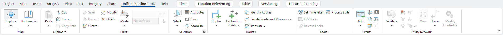

Note: You can also choose to further [manage](https://pro.arcgis.com/en/pro-app/latest/get-started/manage-add-ins.htm) the Unified Pipeline Tools add-in in ArcGIS Pro.

## Instructions

1. Download this repository as a .zip folder, or clone it to your computer.
2. Close any ArcGIS Pro projects that are open.
3. Browse to the downloaded UnifiedPipelineTools folder and extract its contents. 
4. Browse to and run UnifiedPipelineTools.esriAddinX
5. Click Install Add-In on the Esri ArcGIS Add-In Installation Utility dialog box. The add-in is installed.
6. Click OK.
7. Open ArcGIS Pro.

## Requirements

- ArcGIS Pro licensed with the Location Referencing extension

## Resources

- [Pipeline Referencing product documentation](https://pro.arcgis.com/en/pro-app/latest/help/production/location-referencing-pipelines)
- [PDF Help doc: Installing and Using Unified Pipeline Tools add-in](UnifiedPipelineToolsHelp.pdf)

Tool | Description
-- | --
***Navigate and Edit tools***|
Explore  | Move, pan, identify feature attributes via a pop-up, and zoom in and out of maps and scenes.
Bookmarks| Open the gallery of  existing bookmarks and the options to manage them or create more. Bookmarks are navigation shortcuts to a position on a map or perspective in a scene that you can quickly return to or share with others.
Copy | Copy selected features to the clipboard.
Paste | Paste features from the clipboard to the same layer.
Cut 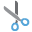| Copy selected features to the clipboard and remove the selected features from the source map.
Copy Path | Copy the path of selected features to the clipboard.
Create | Open the Create Features pane containing feature templates with which you can create features.
Modify | Open the Modify Features pane containing standard editing tools as well as specialized tools available with extensions.
Delete | Delete selected features or parts of a multipart feature.
Save | Save the edits you make to a map or a scene including added or removed layers or maps, and changes to data sources.
Discard | Discard the edits you make to a map or a scene including added or removed layers or maps, and changes to data sources.
Mode | Assign default z-values when you create z-aware features, or set the elevation mode to apply a constant z-value, or get z-values dynamically from an elevation surface layer.
Elevation Value | Provide a z-value to be set as the constant elevation for the newly created features.
Map Surfaces | Select a surface from the available elevation map surfaces to get z-values from the map.
Get Z From View | Obtain a constant elevation from the available map surfaces.
Select | Select features on the map or choose a selection method.
Attributes | View attribute values or edit them in the Attributes pane.
Clear | Clear selected features.
Zoom To | Zoom to selected features.
***Pipeline Referencing Tools*** |  
Create Route | Create routes in an LRS Network using centerline features that define the location and geometry of a route.
Extend Route 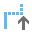| Extend a route in ArcGIS Pipeline Referencing by adding length to the beginning or end of it.
Realign Route | Realign a single route or several adjoining routes that are part of the same line.
Reassign Route | Reassign all or a portion of a route or line to the immediate upstream or downstream of another route or line.
Retire Route | Retire a route segment, an entire route, or multiple adjoining routes that belong to the same line for the specified time frame.
Reverse Route | Reverse the route direction.
Add Calibration Points | Add calibration points to a route.
Edit Calibration Points | Edit and modify route calibration points.
Delete Calibration Points | Delete calibration points on a route.
Identify Routes | Identify routes, their measures, and locking information. Click the Identify Routes tool and then a route.
Locate Route and Measures 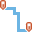| Search for a route and locate measures on it. 
Translate 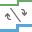| Translate between route ID and route name, as well as line ID and line name. Measures can also be translated between coincident or intersecting routes of the same or different networks.
Set Time Filter | Configure the time view for LRS-managed layers. 
LRS Locks | Review and release line, route, and event locks. 
Release Locks 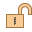| Release any lock whose releasable state value is Yes. Learn more about releasable states
Add Events | Add events of the following type:
  | Point 
  | Line 
 | Multiple Points 
 | Multiple Lines 
Split | Split a line event into two adjoining events. 
Merge 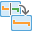| Combine multiple adjoining events into a target event.
DynSeg | Create an output where the events on a route are dynamically segmented together into one record set. The tool returns separate records at any measure along the event where any of the attributes change. |  
Attribute Sets | Use a collection of event layer attributes to create multiple events with a set of additional, organization-specific attributes in a single edit. |  
Configure Replacement 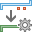| Categorize event layers before event replacement. The measures for the route do not change during event replacement. |  
Replace 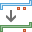| Update events that were part of a replaced pipe using an event replacement configuration that groups event layers so that multiple events can be retired or replaced by new events in a single editing operation. |  
***Utility Network Tools***|
Validate | Keep the network topology updated for analytic events. Dirty areas serve as an indicator that the content you see on the map does not match what is stored in the network topology.
Error Inspector | Validate and fix geodatabase
Terminal Connections 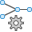| Set a terminal connection between a line and a terminal on a device feature, change the terminal to which the line is connected, or disconnect a line from a device terminal.
Modify 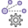 | Launch the Modify Associations pane to manage containment associations between existing network features.
Enter Containment 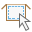| Enter the containment edit mode to automatically create the containment association when creating content features inside an existing container.
Exit Containment | Exit containment edit mode.
Display Content 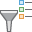| Show or hide containment association content. This enables or disables display filters configured using the association status attribute to turn content feature display on and off based on their visibility property.
View 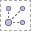| View connectivity or structural attachment associations on the map.
Trace Locations | Set starting points, barriers, or clear all trace locations.
Modify Controller | Modify an existing subnetwork

## Issues

Find a bug or want to request a new feature? Please let us know by submitting an issue.

## Contributing

Esri welcomes contributions from anyone and everyone. Please see our [guidelines for contributing](https://github.com/esri/contributing).

## Licensing

Copyright 2021 Esri

Licensed under the Apache License, Version 2.0 (the "License");
you may not use this file except in compliance with the License.
You may obtain a copy of the License at

http://www.apache.org/licenses/LICENSE-2.0

Unless required by applicable law or agreed to in writing, software
distributed under the License is distributed on an "AS IS" BASIS,
WITHOUT WARRANTIES OR CONDITIONS OF ANY KIND, either express or implied.
See the License for the specific language governing permissions and
limitations under the License.

A copy of the license is available in the repository's [license.txt](https://raw.github.com/Esri/quickstart-map-js/master/license.txt) file.

